# VENOM DRM Glass Template V3 - Project Design Document

## Local Development Environment Setup

This section provides step-by-step instructions for setting up the local development environment for the VENOM DRM Glass Template V3 project.

### Prerequisites

Before beginning the setup process, ensure you have the following installed on your system:
- PHP 8.4 or higher
- Composer (PHP dependency manager)
- MySQL 8.0 or higher
- Node.js (LTS version)
- NPM (Node Package Manager)
- Git

### Repository Setup

1. Navigate to your preferred development directory
2. Clone the repository:
```bash
git clone https://github.com/VenomDRMSolutions/boost12.git
cd boost12
```
3. Initialize a new Laravel 12 project in the current directory:
```bash
composer create-project laravel/laravel . "^12.0"
```

### Environment Configuration

1. Copy the example environment file:
```bash
cp .env.example .env
```
2. Update the database configuration in `.env`:
```env
DB_CONNECTION=mysql
DB_HOST=127.0.0.1
DB_PORT=3306
DB_DATABASE=laravel_boost
DB_USERNAME=venom_4zr1x6
DB_PASSWORD=V7JXHSysJ0zp4U4Z
```
3. Set the application key:
```bash
php artisan key:generate
```
4. Update session configuration in `.env`:
```env
SESSION_LIFETIME=120
SESSION_SECURE_COOKIE=true
```

### Database Setup

1. Connect to MySQL and create the database:
```sql
CREATE DATABASE laravel_boost CHARACTER SET utf8mb4 COLLATE utf8mb4_unicode_ci;
```
2. Test the database connection:
```bash
php artisan migrate:status
```

### Development Tooling Setup

1. Install Laravel Pint for code formatting:
```bash
composer require laravel/pint --dev
```
2. Install Node dependencies:
```bash
npm install
```
3. Install TailwindCSS and related dependencies:
```bash
npm install -D tailwindcss postcss autoprefixer
```
4. Initialize TailwindCSS:
```bash
npx tailwindcss init -p
```

### Authentication Setup

1. Install Laravel Breeze for initial scaffolding:
```bash
composer require laravel/breeze --dev
```
2. Scaffold the authentication views:
```bash
php artisan breeze:install
```

### Frontend Configuration

1. Update `vite.config.js`:
```javascript
import { defineConfig } from 'vite';
import laravel from 'laravel-vite-plugin';

export default defineConfig({
    plugins: [
        laravel({
            input: [
                'resources/css/app.css',
                'resources/js/app.js',
            ],
            refresh: true,
        }),
    ],
});
```
2. Update `tailwind.config.js`:
```javascript
module.exports = {
    content: [
        "./resources/**/*.blade.php",
        "./resources/**/*.js",
        "./resources/**/*.vue",
    ],
    theme: {
        extend: {},
    },
    plugins: [],
}
```
3. Update `resources/css/app.css`:
```css
@tailwind base;
@tailwind components;
@tailwind utilities;

/* CSS variables for themes (light-theme/dark-theme) */
/* CSS variables for neon colors */
/* Glass morphism utility classes */
```

### Verification

1. Start the development server:
```bash
php artisan serve
```
2. In a separate terminal, start Vite:
```bash
npm run dev
```
3. Visit `http://localhost:8000` to verify the Laravel welcome page
4. Run the initial migrations:
```bash
php artisan migrate
```

### IDE Configuration

1. Set up Laravel Pint as the code formatter in your IDE
2. Configure your IDE to use the project's PHP version (8.4)
3. Set line endings to LF (Unix)
4. Set indentation to 4 spaces
5. Enable trimming of trailing whitespace

## 1. Overview

### 1.1 Project Name
VENOM DRM Glass Template V3 - Neon Glass Design

### 1.2 Technology Stack
- **Backend**: PHP 8.4, Laravel 12
- **Database**: MySQL
- **Frontend**: TailwindCSS (via Vite)
- **Design System**: Neon Glass v3 with light/dark themes and 7 neon color options

### 1.3 Core Features
- User Management System with role-based access control
- DRM Reports System for tracking script issues
- Activity Logs for comprehensive audit trail
- Admin Panel with settings management
- DRM IP Whitelist System for content protection
- Invitation-based registration system

### 1.4 Project Goals
- Build a professional, scalable admin panel with strict UI/UX consistency
- Implement component reusability and clean separation of concerns
- Apply Neon Glass v3 visual language: tasteful glass effects, neon edges/glow
- Maintain strong readability with WCAG 2.1 AA compliance
- Enforce security-first architecture with role-based access control
- Achieve full accessibility compliance with keyboard navigation and screen reader support

## 2. Architecture

### 2.1 System Architecture
The VENOM DRM Glass Template V3 follows a traditional MVC architecture with Laravel as the backend framework:

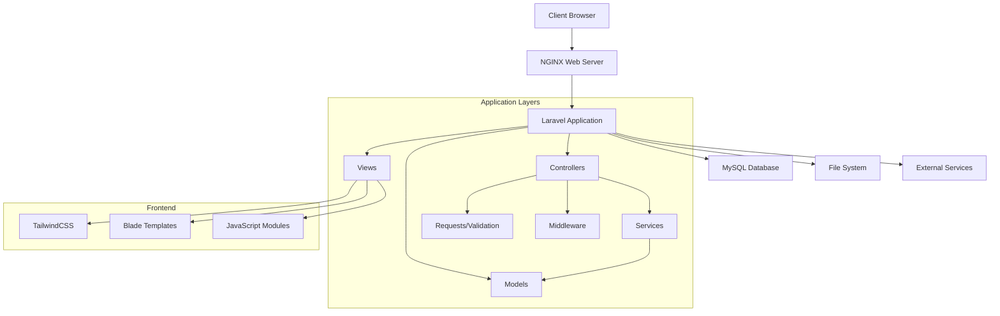

### 2.2 Frontend Architecture
The frontend follows a component-based architecture using Blade components and modular JavaScript:

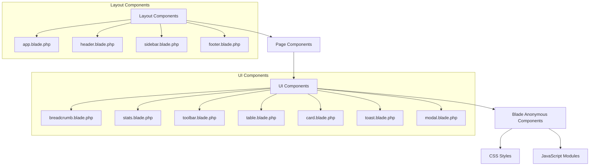

### 2.3 Backend Architecture
The backend follows Laravel's MVC pattern with additional service layers for business logic:

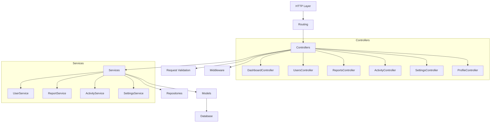

## 3. API Endpoints Reference

### 3.1 Authentication Endpoints
| Method | Endpoint                    | Description               | Authentication |
| ------ | --------------------------- | ------------------------- | -------------- |
| GET    | `/login`                    | Display login form        | None           |
| POST   | `/login`                    | Process login             | None           |
| POST   | `/logout`                   | Logout user               | Auth           |
| GET    | `/register/{token}`         | Display registration form | None           |
| POST   | `/register`                 | Process registration      | None           |
| GET    | `/email/verify/{id}/{hash}` | Verify email              | Auth           |
| POST   | `/password/email`           | Send password reset link  | None           |
| POST   | `/password/reset`           | Reset password            | None           |

### 3.2 Dashboard Endpoints
| Method | Endpoint     | Description    | Authentication    |
| ------ | ------------ | -------------- | ----------------- |
| GET    | `/dashboard` | User dashboard | Auth (user/admin) |

### 3.3 User Management Endpoints
| Method | Endpoint             | Description           | Authentication |
| ------ | -------------------- | --------------------- | -------------- |
| GET    | `/users`             | List all users        | Auth (admin)   |
| GET    | `/users/create`      | Show create user form | Auth (admin)   |
| POST   | `/users`             | Create new user       | Auth (admin)   |
| GET    | `/users/{user}`      | Show user details     | Auth (admin)   |
| GET    | `/users/{user}/edit` | Show edit user form   | Auth (admin)   |
| PUT    | `/users/{user}`      | Update user           | Auth (admin)   |
| DELETE | `/users/{user}`      | Delete user           | Auth (admin)   |

### 3.4 Reports Endpoints
| Method | Endpoint            | Description                          | Authentication    |
| ------ | ------------------- | ------------------------------------ | ----------------- |
| GET    | `/reports`          | Redirect to appropriate reports view | Auth (user/admin) |
| GET    | `/reports/mine`     | List user's reports                  | Auth (user/admin) |
| GET    | `/reports/admin`    | List all reports                     | Auth (admin)      |
| GET    | `/reports/create`   | Show create report form              | Auth (user/admin) |
| POST   | `/reports`          | Create new report                    | Auth (user/admin) |
| GET    | `/reports/{report}` | Show report details                  | Auth (user/admin) |
| PUT    | `/reports/{report}` | Update report (admin only)           | Auth (admin)      |

### 3.5 Activity Logs Endpoints
| Method | Endpoint          | Description                           | Authentication    |
| ------ | ----------------- | ------------------------------------- | ----------------- |
| GET    | `/activity`       | Redirect to appropriate activity view | Auth (user/admin) |
| GET    | `/activity/mine`  | List user's activity                  | Auth (user/admin) |
| GET    | `/activity/admin` | List all activity                     | Auth (admin)      |

### 3.6 Settings Endpoints
| Method | Endpoint                | Description                  | Authentication |
| ------ | ----------------------- | ---------------------------- | -------------- |
| GET    | `/settings`             | Redirect to general settings | Auth (admin)   |
| GET    | `/settings/general`     | Show general settings        | Auth (admin)   |
| PUT    | `/settings/general`     | Update general settings      | Auth (admin)   |
| GET    | `/settings/appearance`  | Show appearance settings     | Auth (admin)   |
| PUT    | `/settings/appearance`  | Update appearance settings   | Auth (admin)   |
| GET    | `/settings/project`     | Show project settings        | Auth (admin)   |
| PUT    | `/settings/project`     | Update project settings      | Auth (admin)   |
| GET    | `/settings/environment` | Show environment settings    | Auth (admin)   |
| PUT    | `/settings/environment` | Update environment settings  | Auth (admin)   |

### 3.7 Profile Endpoints
| Method | Endpoint   | Description         | Authentication    |
| ------ | ---------- | ------------------- | ----------------- |
| GET    | `/profile` | Show user profile   | Auth (user/admin) |
| PUT    | `/profile` | Update user profile | Auth (user/admin) |

## 4. Data Models & ORM Mapping

### 4.1 User Model
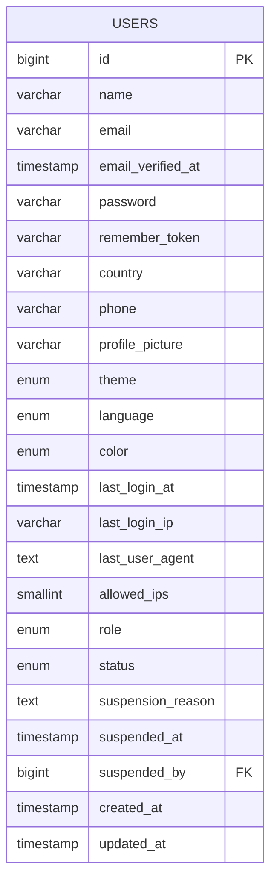

### 4.2 DRM Reports Model
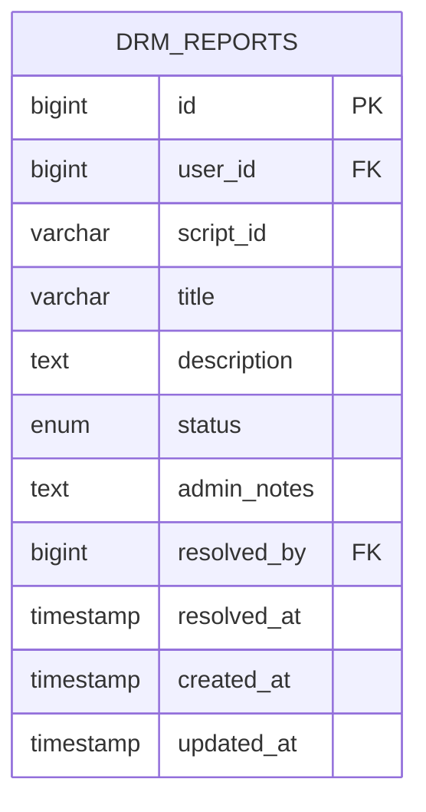

### 4.3 Activity Logs Model
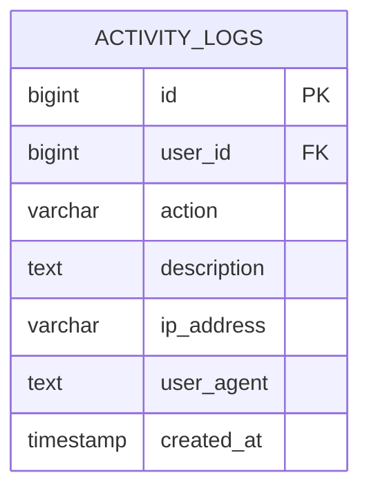

### 4.4 User IPs Model
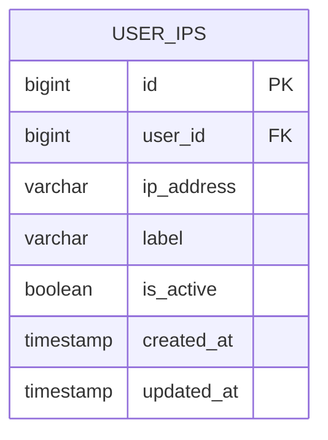

### 4.5 Invitations Model
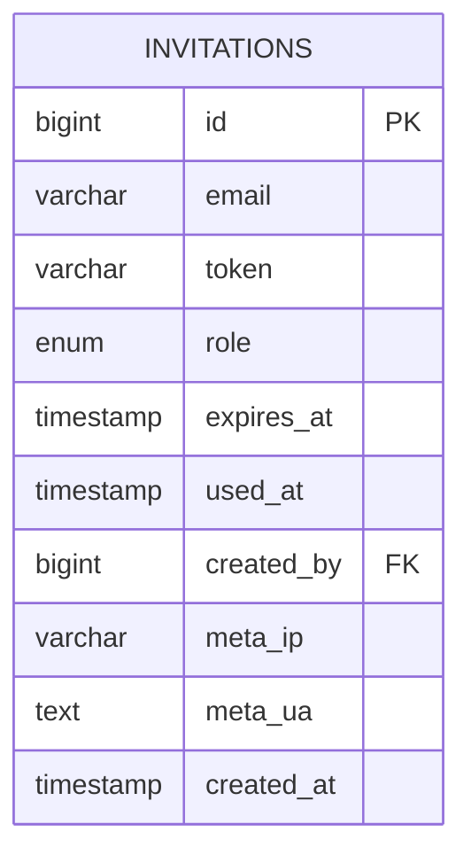

### 4.6 Licenses Model
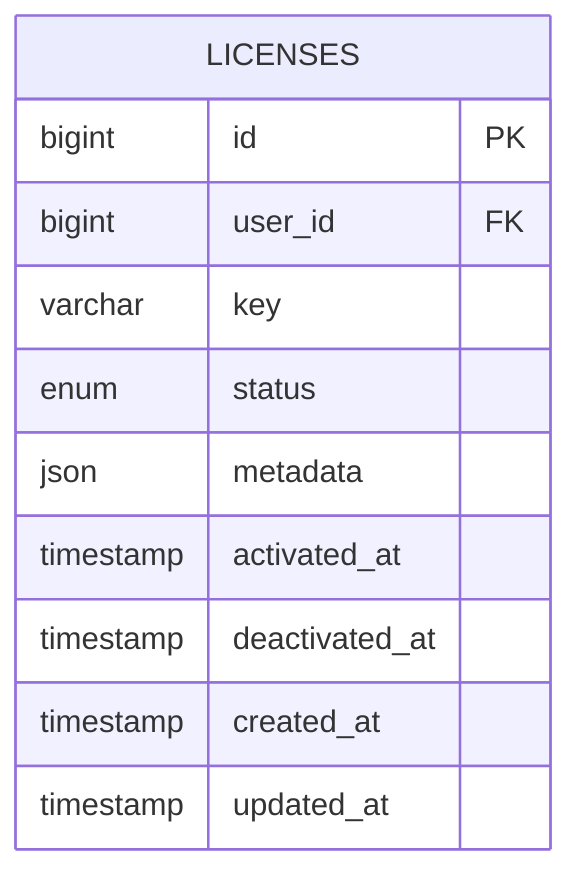

### 4.7 System Settings Model
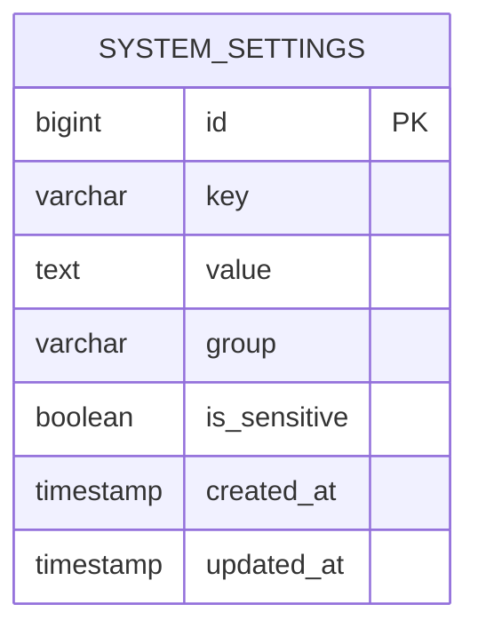

### 4.8 Database Relationships
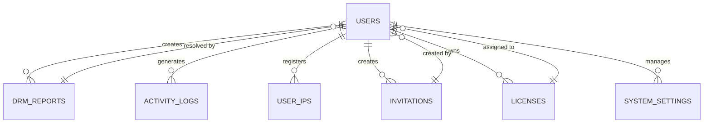

## 5. Business Logic Layer

### 5.1 Authentication Flow
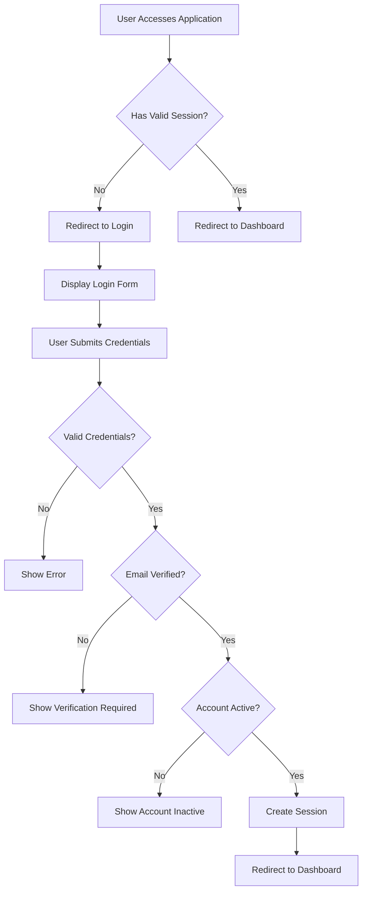

### 5.2 Registration Flow
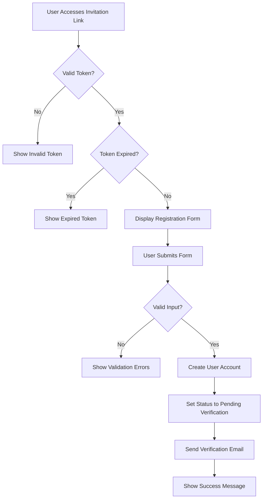

### 5.3 Report Management
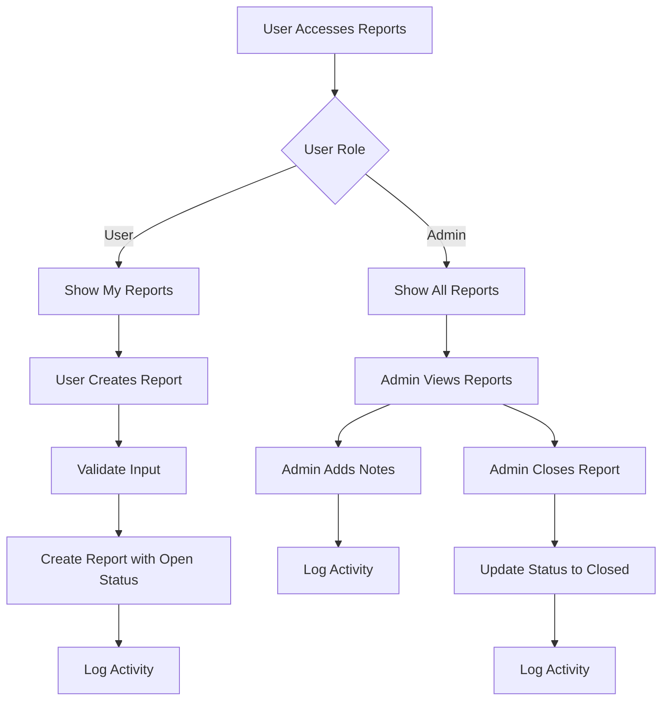

### 5.4 IP Management
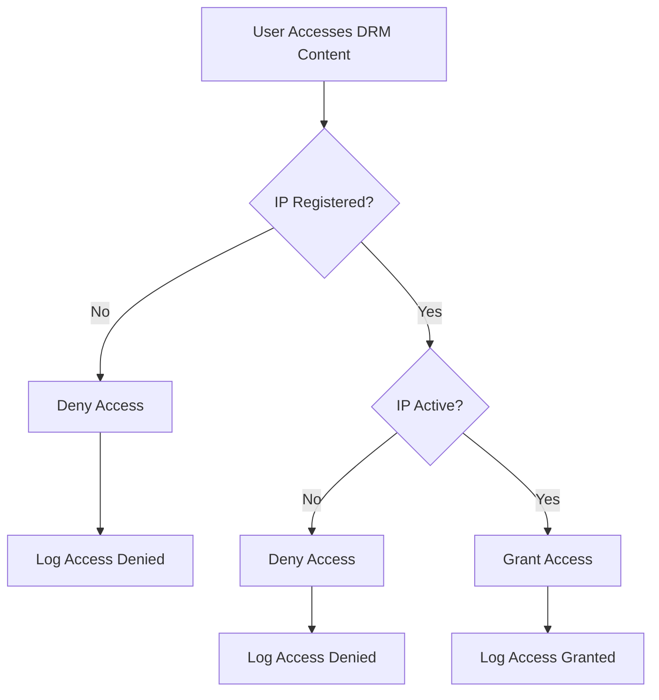

## 6. Middleware & Interceptors

### 6.1 Authentication Middleware
- `auth` - Ensures user is authenticated
- `verified` - Ensures user has verified their email
- `role:admin` - Restricts access to admin users only
- `role:user` - Restricts access to regular users only

### 6.2 Custom Middleware
- `EnsureUserIsActive` - Checks that user account is active
- `EnsureUserNotSuspended` - Checks that user account is not suspended
- `EnsureEmailVerified` - Custom email verification check
- `ThrottleRequests` - Rate limiting for API endpoints

### 6.3 Route Middleware Groups
```php
'admin' => [
    'auth',
    'verified',
    'role:admin',
    'EnsureUserIsActive',
    'EnsureUserNotSuspended'
],

'user' => [
    'auth',
    'verified',
    'EnsureUserIsActive',
    'EnsureUserNotSuspended'
]
```

## 7. Component Architecture

### 7.1 Layout Components

#### 7.1.1 Main Application Layout
- **File**: `resources/views/layouts/app.blade.php`
- **Purpose**: Main wrapper for all application pages
- **Features**:
  - Includes header, sidebar, and footer components
  - Loads global CSS and JavaScript assets
  - Provides stack placeholders for page-specific assets

#### 7.1.2 Header Component
- **File**: `resources/views/layouts/header.blade.php`
- **Features**:
  - Fixed position at top of screen
  - Responsive sidebar toggle
  - Theme toggle (light/dark)
  - Neon color selector (7 options)
  - Language selector (en/fr/es)
  - Notifications center with badge
  - User profile menu

#### 7.1.3 Sidebar Component
- **File**: `resources/views/layouts/sidebar.blade.php`
- **Features**:
  - Fixed dark mode design (unaffected by theme changes)
  - Neon color customization based on user preference
  - Glass morphism effects
  - Responsive behavior (open/hidden states)
  - Navigation menu with role-based filtering

#### 7.1.4 Footer Component
- **File**: `resources/views/layouts/footer.blade.php`
- **Features**:
  - Fixed position at bottom of screen
  - Consistent styling with overall design system

### 7.2 Reusable UI Components

#### 7.2.1 Breadcrumb Component
- **File**: `resources/views/components/breadcrumb.blade.php`
- **Usage**: `<x-breadcrumb :items="$items" />`
- **Features**:
  - Displays navigation path
  - Includes action buttons
  - Supports active state highlighting

#### 7.2.2 Stats Cards Component
- **File**: `resources/views/components/stats.blade.php`
- **Usage**: `<x-stats :items="$stats" />`
- **Features**:
  - Exactly 4 cards per page
  - Displays key metrics with icons
  - Neon glass design with hover effects
  - Support for hint text (e.g., "+12% WoW")

#### 7.2.3 Toolbar Component
- **File**: `resources/views/components/toolbar.blade.php`
- **Usage**: `<x-toolbar :title="$title" :actions="$actions" />`
- **Features**:
  - Search bar for filtering
  - Bulk actions select list with apply button
  - Advanced filter options
  - View toggle (table/card)
  - Contextual action buttons

#### 7.2.4 Table Component
- **File**: `resources/views/components/table.blade.php`
- **Usage**: `<x-table :columns="$columns" :rows="$rows" :pagination="$pagination" />`
- **Features**:
  - Sortable columns
  - Responsive design
  - Pagination support
  - Custom cell rendering slots

#### 7.2.5 Card Component
- **File**: `resources/views/components/card.blade.php`
- **Usage**: `<x-card :title="$title"> ... </x-card>`
- **Features**:
  - Glass morphism borders
  - Neon glow effects
  - Support for subtitle and footer slots
  - Responsive design

#### 7.2.6 Toast Component
- **File**: `resources/views/components/toast.blade.php`
- **Usage**: `<x-toast />`
- **Features**:
  - Notification display system
  - Multiple notification types (success, error, warning, info)
  - Auto-dismissal with manual override
  - Queue management

#### 7.2.7 Modal Component
- **File**: `resources/views/components/modal.blade.php`
- **Usage**: `<x-modal :id="$id" :title="$title"> ... </x-modal>`
- **Features**:
  - Focus trapping for accessibility
  - Keyboard navigation support
  - Custom open/close triggers
  - Responsive sizing

## 8. State Management

### 8.1 User Preferences
User preferences are stored directly in the `users` table:
- `theme`: ENUM('light-theme', 'dark-theme')
- `language`: ENUM('en', 'fr', 'es')
- `color`: ENUM('purple', 'blue', 'green', 'red', 'orange', 'pink', 'indigo')

### 8.2 Theme Management
Themes are implemented using CSS classes applied to the `<html>` element:
- `light-theme` - Light mode with high contrast
- `dark-theme` - Dark mode with neon glow enhancement

### 8.3 Neon Color System
Seven neon color options are available:
1. Purple (default)
2. Blue
3. Green
4. Red
5. Orange
6. Pink
7. Indigo

Colors are implemented using CSS variables that change based on user selection.

### 8.4 Guest Session Handling
- Login page uses LocalStorage for temporary theme/color preferences
- Post-authentication preferences are read from the users table
- Default values are applied during user creation

## 9. Security Model

### 9.1 Authentication & Authorization
- Invitation-only registration system
- Email verification required before login
- Role-based access control (admin/user)
- Session management with 2-hour timeout
- "Remember me" option extends session to 12 hours

### 9.2 Data Protection
- Sensitive environment variables are masked in UI
- All .env file changes are backed up with rotation
- Activity logs track all user and admin actions
- IP address tracking for security monitoring

### 9.3 Input Validation
- Comprehensive validation for all user inputs
- SQL injection prevention through Eloquent ORM
- XSS protection through Blade escaping
- CSRF protection for all state-changing requests

### 9.4 Access Control
- Admin-only access to settings pages
- User-specific data scoping
- IP-based content access control for DRM
- Suspension system with mandatory reasons

## 10. Testing Strategy

### 10.1 Unit Testing
- Model validation and relationships
- Service layer business logic
- Helper functions and utilities
- Target: 80%+ code coverage

### 10.2 Feature Testing
- Authentication flows
- Registration and email verification
- Report creation and management
- Activity logging functionality
- Settings management
- IP whitelist functionality

### 10.3 UI/UX Testing
- Responsive design on all screen sizes
- Theme and color switching
- WCAG 2.1 AA compliance
- Keyboard navigation
- Screen reader compatibility

### 10.4 Security Testing
- SQL injection attempts
- XSS vulnerability testing
- CSRF protection validation
- Authentication bypass attempts
- Input sanitization verification

## 11. Performance Considerations

### 11.1 Database Optimization
- Proper indexing on frequently queried columns
- Eager loading to prevent N+1 queries
- Query optimization for large datasets
- Pagination for data display pages

### 11.2 Frontend Optimization
- Asset minification through Vite
- Lazy loading for non-critical resources
- Efficient JavaScript modules
- CSS optimization with Tailwind

### 11.3 Caching Strategy
- Route caching for improved performance
- Configuration caching
- View caching for Blade templates
- Database query caching for repetitive queries

## 12. Deployment Architecture

### 12.1 Server Requirements
- PHP 8.4+
- MySQL 8.0+
- NGINX web server
- Composer for PHP dependencies
- NPM for frontend assets

### 12.2 Environment Configuration
```env
DB_CONNECTION=mysql
DB_HOST=127.0.0.1
DB_PORT=3306
DB_DATABASE=laravel_boost
DB_USERNAME=venom_4zr1x6
DB_PASSWORD=V7JXHSysJ0zp4U4Z
```

### 12.3 CI/CD Pipeline
- Automated testing on all pull requests
- Code quality checks with Laravel Pint
- Security scanning
- Automated deployment to staging/production
- Rollback procedures

## 13. Accessibility Compliance

### 13.1 WCAG 2.1 AA Requirements
- Keyboard navigation support
- Screen reader compatibility
- Sufficient color contrast ratios
- Focus indicators for interactive elements
- Semantic HTML structure

### 13.2 ARIA Implementation
- Proper labels for form elements
- Landmark regions for navigation
- Descriptive link text
- Alert roles for notifications
- Modal dialog accessibility

## 14. Internationalization

### 14.1 Supported Languages
- English (en) - default
- French (fr)
- Spanish (es)

### 14.2 Language Switching
- User preference stored in database
- Automatic detection of browser language
- Consistent terminology across all languages
- Right-to-left language support preparation

## 15. Project Implementation Plan

This section outlines a detailed, step-by-step plan for implementing the VENOM DRM Glass Template V3 project. Each phase includes specific tasks with completion checkboxes to track progress.

### Phase 1: Project Setup & Environment Configuration [Estimated: 2-3 days]

#### Task 1.1: Development Environment Setup
- [ ] Install PHP 8.4
- [ ] Install Composer
- [ ] Install MySQL 8.0+
- [ ] Install Node.js (LTS version)
- [ ] Install NPM
- [ ] Configure PHP development settings
- [ ] Set up MySQL database with provided credentials

#### Task 1.2: Laravel Project Initialization
- [ ] Create new Laravel 12 project
- [ ] Configure .env file with provided database credentials
- [ ] Set up Laravel authentication scaffolding
- [ ] Configure Laravel logging
- [ ] Set up error handling and exception reporting

#### Task 1.3: Version Control Setup
- [ ] Initialize Git repository
- [ ] Create .gitignore with Laravel-specific entries
- [ ] Set up Git hooks for commit message validation
- [ ] Configure branch protection rules (if using GitHub)
- [ ] Create initial commit with project structure

#### Task 1.4: Development Tooling
- [ ] Install and configure Laravel Pint for PHP code formatting
- [ ] Set up ESLint for JavaScript linting
- [ ] Configure Stylelint for CSS linting
- [ ] Install and configure PHPUnit for testing
- [ ] Set up CI/CD pipeline configuration files
- [ ] Configure IDE with project-specific settings

### Phase 2: Database Design & Implementation [Estimated: 3-4 days]

#### Task 2.1: Database Schema Implementation
- [ ] Create users table with all specified fields
- [ ] Create drm_reports table with all specified fields
- [ ] Create activity_logs table with all specified fields
- [ ] Create user_ips table for DRM IP management
- [ ] Add foreign key constraints and indexes
- [ ] Implement database migrations

#### Task 2.2: Database Seeding
- [ ] Create seeder for default admin user
- [ ] Create seeder for sample users
- [ ] Create seeder for sample DRM reports
- [ ] Create seeder for sample activity logs
- [ ] Create seeder for sample IP addresses
- [ ] Run all seeders and verify data integrity

#### Task 2.3: Model Implementation
- [ ] Create User model with all relationships
- [ ] Create DrmReport model with relationships
- [ ] Create ActivityLog model with relationships
- [ ] Create UserIp model for DRM IP management
- [ ] Implement model factories for testing
- [ ] Add model validation rules and accessors/mutators

### Phase 3: Authentication & User Management [Estimated: 4-5 days]

#### Task 3.1: Authentication System
- [ ] Implement login functionality
- [ ] Implement registration (invitation-only)
- [ ] Implement email verification workflow
- [ ] Implement password reset functionality
- [ ] Implement "remember me" functionality
- [ ] Add login attempt throttling

#### Task 3.2: User Management Features
- [ ] Create user profile page
- [ ] Implement profile picture upload
- [ ] Add country and phone number fields to registration
- [ ] Implement user preferences (theme, language, color)
- [ ] Create user settings page
- [ ] Add validation for all user input fields

#### Task 3.3: Role-Based Access Control
- [ ] Implement role middleware (admin/user)
- [ ] Create role-based navigation filtering
- [ ] Implement route protection for admin-only pages
- [ ] Add user suspension functionality
- [ ] Create user management dashboard for admins
- [ ] Implement user search and filtering

### Phase 4: Frontend Architecture & Design System [Estimated: 5-7 days]

#### Task 4.1: Asset Management Setup
- [ ] Configure Vite for asset compilation
- [ ] Set up TailwindCSS with project-specific configuration
- [ ] Create directory structure for CSS/JS components
- [ ] Implement theme switching functionality
- [ ] Implement neon color system
- [ ] Set up language switching (en/fr/es)

#### Task 4.2: Core Layout Components
- [ ] Create main application layout (app.blade.php)
- [ ] Implement responsive header component
- [ ] Create sidebar component with neon glass design
- [ ] Implement footer component
- [ ] Add theme-aware styling to all components
- [ ] Ensure WCAG 2.1 AA compliance

#### Task 4.3: UI Component Library
- [ ] Create reusable button components
- [ ] Implement form input components
- [ ] Create card components for dashboard
- [ ] Build stats card components
- [ ] Implement breadcrumb component
- [ ] Create toolbar component with search/filter

#### Task 4.4: Design System Implementation
- [ ] Implement glass morphism effects
- [ ] Create neon glow effects for active elements
- [ ] Implement light/dark theme switching
- [ ] Add all 7 neon color variants
- [ ] Ensure consistent design language across all pages
- [ ] Implement responsive design for all screen sizes

### Phase 5: Core Feature Implementation [Estimated: 8-10 days]

#### Task 5.1: Dashboard Implementation
- [ ] Create dashboard layout
- [ ] Implement 4 stats cards with relevant metrics
- [ ] Add recent activity section
- [ ] Create quick action buttons
- [ ] Implement theme/color/language selectors
- [ ] Add responsive design for all screen sizes

#### Task 5.2: DRM Reports System
- [ ] Create reports index page
- [ ] Implement "My Reports" view for users
- [ ] Implement "All Reports" view for admins
- [ ] Create report submission form
- [ ] Add admin notes functionality
- [ ] Implement report status management (open/closed)

#### Task 5.3: Activity Logs System
- [ ] Create activity logs index page
- [ ] Implement user-specific activity view
- [ ] Create admin view with all users' activities
- [ ] Add filtering by action type
- [ ] Implement date range filtering
- [ ] Add search functionality across all fields

#### Task 5.4: User Management (Admin)
- [ ] Create user management dashboard
- [ ] Implement user search and filtering
- [ ] Add user suspension functionality
- [ ] Implement role management (user/admin)
- [ ] Create user detail view
- [ ] Add bulk actions for user management

### Phase 6: Settings & Configuration [Estimated: 3-4 days]

#### Task 6.1: User Profile Settings
- [ ] Create profile settings page
- [ ] Implement theme selection
- [ ] Add language selection (en/fr/es)
- [ ] Implement color selection (7 neon options)
- [ ] Add profile picture upload
- [ ] Include country and phone number management

#### Task 6.2: Admin Settings System
- [ ] Create settings dashboard with navigation
- [ ] Implement general settings page
- [ ] Create appearance settings page
- [ ] Add project settings page
- [ ] Implement environment settings management
- [ ] Add validation for all settings inputs

#### Task 6.3: Environment Variable Management
- [ ] Create interface for managing .env variables
- [ ] Implement secure handling of sensitive values
- [ ] Add .env backup functionality
- [ ] Implement rollback mechanism
- [ ] Add activity logging for environment changes
- [ ] Ensure proper file permissions for backups

### Phase 7: DRM IP Management System [Estimated: 2-3 days]

#### Task 7.1: IP Management Features
- [ ] Create IP management dashboard
- [ ] Implement IP registration functionality
- [ ] Add IP labeling feature
- [ ] Create IP activation/deactivation controls
- [ ] Implement IP limit management
- [ ] Add validation for IP format and duplicates

#### Task 7.2: Access Control Integration
- [ ] Implement IP verification for content access
- [ ] Create access denied handling
- [ ] Add logging for access attempts
- [ ] Implement admin override capabilities
- [ ] Create IP management reports
- [ ] Add bulk IP management actions

### Phase 8: Testing & Quality Assurance [Estimated: 4-5 days]

#### Task 8.1: Unit Testing
- [ ] Write unit tests for User model
- [ ] Write unit tests for DrmReport model
- [ ] Write unit tests for ActivityLog model
- [ ] Write unit tests for UserIp model
- [ ] Test authentication and authorization logic
- [ ] Test all model relationships and scopes

#### Task 8.2: Feature Testing
- [ ] Test user registration flow
- [ ] Test login and authentication
- [ ] Test role-based access control
- [ ] Test report submission and management
- [ ] Test activity logging functionality
- [ ] Test settings and configuration changes

#### Task 8.3: UI/UX Testing
- [ ] Test responsive design on all screen sizes
- [ ] Verify theme switching functionality
- [ ] Test neon color options
- [ ] Validate WCAG 2.1 AA compliance
- [ ] Test keyboard navigation
- [ ] Verify all interactive elements work correctly

#### Task 8.4: Security Testing
- [ ] Test SQL injection prevention
- [ ] Test XSS protection
- [ ] Verify CSRF protection
- [ ] Test authentication bypass attempts
- [ ] Validate input sanitization
- [ ] Test file upload security

### Phase 9: Performance Optimization & Deployment [Estimated: 2-3 days]

#### Task 9.1: Performance Optimization
- [ ] Optimize database queries
- [ ] Implement caching strategies
- [ ] Optimize asset loading
- [ ] Minify CSS/JS assets
- [ ] Implement lazy loading where appropriate
- [ ] Optimize images and media

#### Task 9.2: Deployment Preparation
- [ ] Create production deployment scripts
- [ ] Configure production environment variables
- [ ] Set up logging for production
- [ ] Implement error monitoring
- [ ] Create backup and restore procedures
- [ ] Document deployment process

#### Task 9.3: CI/CD Pipeline
- [ ] Set up automated testing pipeline
- [ ] Implement code quality checks
- [ ] Add security scanning
- [ ] Configure automated deployment
- [ ] Set up staging environment
- [ ] Implement rollback procedures

### Phase 10: Documentation & Knowledge Transfer [Estimated: 2-3 days]

#### Task 10.1: Technical Documentation
- [ ] Create API documentation
- [ ] Document database schema
- [ ] Write code style guide
- [ ] Document deployment process
- [ ] Create troubleshooting guide
- [ ] Document security practices

#### Task 10.2: User Documentation
- [ ] Create user manual
- [ ] Document admin procedures
- [ ] Create FAQ section
- [ ] Write onboarding guide
- [ ] Document report submission process
- [ ] Create IP management guide

#### Task 10.3: Project Handover
- [ ] Create project summary document
- [ ] Document known issues and limitations
- [ ] Create future enhancement roadmap
- [ ] Transfer knowledge to team members
- [ ] Conduct project walkthrough
- [ ] Archive project files and documentation

### Project Timeline Summary

| Phase                             | Duration       | Start Date | End Date |
| --------------------------------- | -------------- | ---------- | -------- |
| Phase 1: Setup & Environment      | 2-3 days       | TBD        | TBD      |
| Phase 2: Database Design          | 3-4 days       | TBD        | TBD      |
| Phase 3: Authentication & Users   | 4-5 days       | TBD        | TBD      |
| Phase 4: Frontend Architecture    | 5-7 days       | TBD        | TBD      |
| Phase 5: Core Features            | 8-10 days      | TBD        | TBD      |
| Phase 6: Settings & Configuration | 3-4 days       | TBD        | TBD      |
| Phase 7: DRM IP Management        | 2-3 days       | TBD        | TBD      |
| Phase 8: Testing & QA             | 4-5 days       | TBD        | TBD      |
| Phase 9: Performance & Deployment | 2-3 days       | TBD        | TBD      |
| Phase 10: Documentation           | 2-3 days       | TBD        | TBD      |
| **Total Estimated Duration**      | **35-47 days** |            |          |

### Success Criteria

- [ ] All core features implemented according to specification
- [ ] Responsive design working on all device sizes
- [ ] Theme and color system fully functional
- [ ] Role-based access control properly implemented
- [ ] All database relationships correctly established
- [ ] Comprehensive test coverage (80%+)
- [ ] WCAG 2.1 AA compliance achieved
- [ ] Performance benchmarks met
- [ ] Security vulnerabilities addressed
- [ ] Complete documentation created
- [ ] Successful deployment to production environment

### Risk Mitigation

1. **Technology Risks:**
   - Mitigation: Early proof-of-concept for critical components
   - Contingency: Alternative libraries or approaches identified

2. **Resource Risks:**
   - Mitigation: Regular progress reviews and scope adjustments
   - Contingency: Prioritization of essential features

3. **Timeline Risks:**
   - Mitigation: Buffer time included in estimates
   - Contingency: Phased delivery approach if needed

4. **Quality Risks:**
   - Mitigation: Continuous integration with automated testing
   - Contingency: Code review process and pair programming